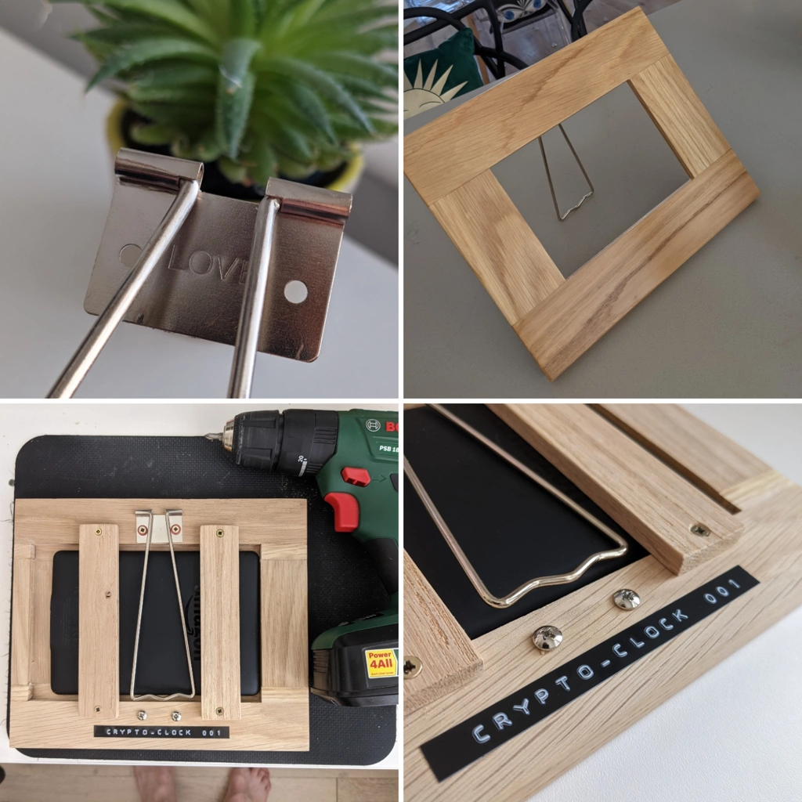
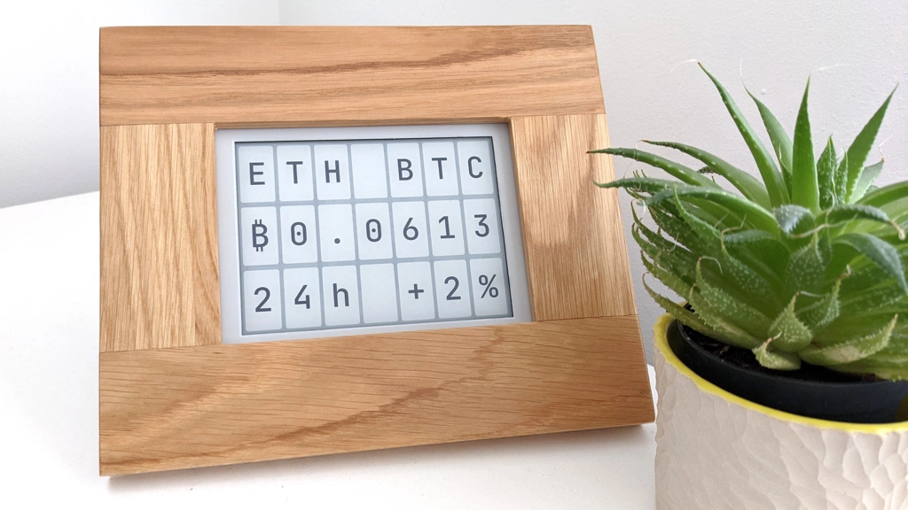

_(I've also posted this article [over on Medium](https://medium.com/@jimmyff/crypto-clock-the-crypto-currency-ticker-that-runs-on-a-kindle-2bc601244556))_

I had a special birthday coming up and I wanted to make a cool gift to mark the occasion. As the recipient is interested in crypto currencies & blockchain tech, I thought a desk/shelf crypto price ticker would be a cool present. I found a couple of products online but they were either not very good or prohibitively expensive so I decided to have a go at building one myself.

_TLDR: [Code available on Github](https://github.com/jimmyff/crypto-clock) & [try it in your browser](https://jimmyff.github.io/crypto-clock/desktop.html)._

 



## Concept

I thought it would be cool if the device looked like a retro departures board, periodically cycling through various crypto prices. I wanted it to have low power consumption, always showing the latest prices, configurable & attractive.

## Hardware

At first I looked at split flap displays but it turns out they’re hard to come by & expensive. I decided to go for an eink display which I figured I could make to look like a split flap display. I’d heard about rooting Kindles and using them in DIY projects so I decided to go down that route, I managed to pick up a Kindle Paperwhite 2 on eBay for the bargain price of £18. Rooting the Kindle was easy enough; details on how to do that are out of the scope of this write up but I’m sure you’ll find all the information you need over on the ‘mobile read’ forum. I then got a Linux desktop running on the Kindle, ready to run my app.

## Software

Using my language of choice (Dart) I decided to make a web app that would run in a kiosk mode browser. I went for the Midori browser as it has way less overhead than Chromium or Firefox. I designed the UI to look like a 7x3 split flap display. I added a simple character by character transition as the display updates which flows across it just like the old departure boards. Also by setting each character black for a second as it transitions does a lovely job of resetting the eink to avoid any ghosting. For the data source I used the Binance API which was super easy to use. As the Kindle had a touch screen I made it so tapping the left or right side of the screen would cycle between the crypto symbol pairs. I also added a configuration screen which you can access by hitting the central column on the display. The configuration screen allows you to choose which symbol pairs to cycle through and the duration to rest on each. With it being an eink display, having a long time between updates results in much less power consumption. I decided on 60 seconds as the default update time.

The final addition to the software was adding the clock mode. At the end of each hour it displays the time so you can watch the turning of the hour. One of my favourite features is I added a sun which rises on the left in the morning, and as each hour passes it moves up and over and sets on the right. When the sun sets the moon comes up and in the midst of the night, the stars come out and twinkle. It think it’s a really playful little addition to the crypto ticker and the concept reminds me of those fancy mechanical cuckoo clocks.

I’ve made the code open source so you can grab it over on Github. If you don’t want the code but you just want to run it, there are two hosted versions: Mobile/desktop version or dedicated device version.

## Finishing touches

As this is something designed to be seen often, it needed to look good. I commissioned an oak lacquered frame at my local carpenters. I detached the Kindle’s front panel and sprayed it white to make it look like an artwork’s border/mount. Finally I did some shopping on eBay and I got a metal frame kick stand for the back and found a nice white power cable. A little homemade label with the serial number 001 completes the look.

## Possible upgrades

- I may at some point port the code to flutter and compile a Linux desktop app and see how that runs on the Kindle. I imagine this would give cleaner letter transitions & run at a higher frame rate.
- I’ve also been playing around with the Rust language recently, and it would be fun to write a Rust version. It would actually be a really good fit as Rust can run on bare metal embedded systems.
- It would be cool to buy a dedicated eink display and drive it from a Raspberry Pi (probably a Pi Zero to keep it affordable); You can get single colour eink displays (black, white + red/yellow) for around £50, having colour would open up new possibilities in terms of UI.
- I also thought about buying some individual 2-3" eink displays (or 7-segment-displays) and using each one of those as a character. This would be quite similar to one of the inspirations of this project (the original block clock). I might order some and have a play around with them for some future project!

## Final thoughts

I’ve had loads of fun making this project and I’m super happy with the way the Crypto Clock turned out! I’m sure it’s going to make an awesome gift.

If you decide to make a crypto clock please let me know! I’d love to see photos of your creations! :)

